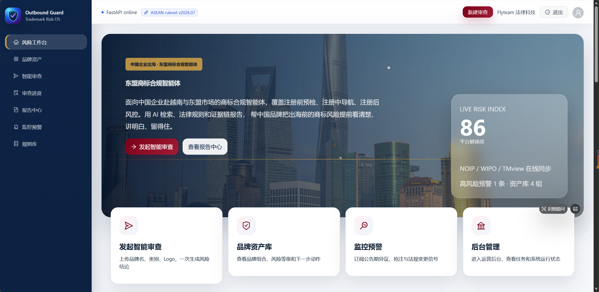
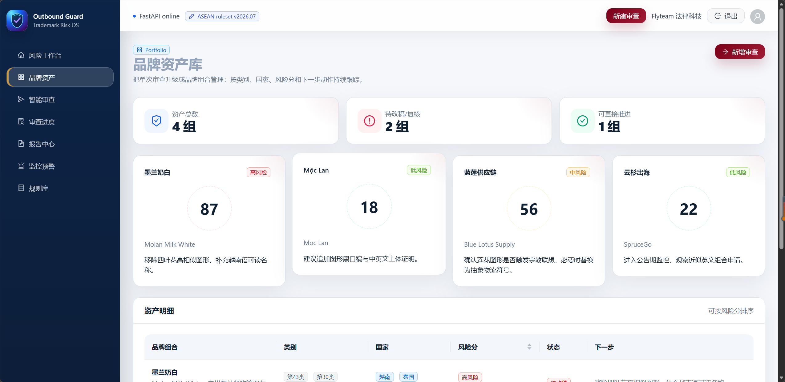
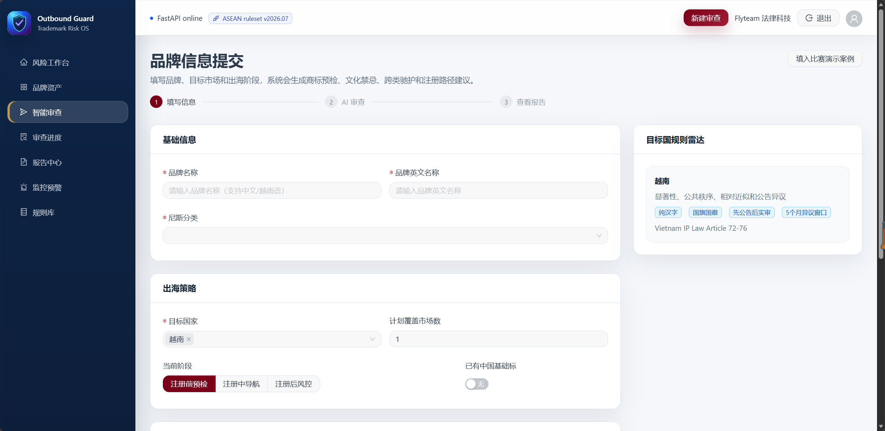
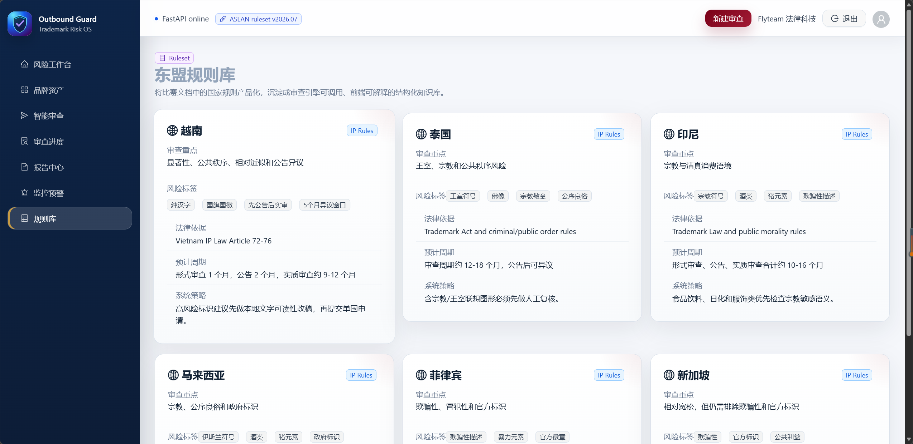

# 智汇法律项目总结文档

## 一、项目基本信息

- 项目名称：智汇法律 / Outbound Guard
- 队伍名称：Flyteam
- 项目定位：面向中国企业出海东盟市场的商标合规与风险管理智能体系统
- 本地前端地址：http://127.0.0.1:5173/
- 本地后端地址：http://127.0.0.1:8000/
- 后端健康检查：http://127.0.0.1:8000/api/health
- 测试账号：2395719665@qq.com
- 测试账号说明：该账号为普通企业用户账号，使用注册时设置的密码登录。后台演示账号可使用 admin / admin123。

## 二、运行说明

### 1. 环境要求

- 操作系统：Windows
- 前端环境：Node.js + npm
- 后端环境：Python 3 + FastAPI + Uvicorn
- 数据库：SQLite，本地文件数据库

### 2. 项目目录

项目本地目录：

```text
E:\codex项目\本地电脑\法律项目测试\Flyteam
```

主要目录说明：

```text
backend/        后端 FastAPI 服务
src/            前端 React 页面与业务逻辑
public/         前端静态资源
docs/           项目文档
tests/          测试相关文件
backend/data/   SQLite 数据库文件目录
```

### 3. 后端启动方式

进入后端目录：

```powershell
cd E:\codex项目\本地电脑\法律项目测试\Flyteam\backend
.\venv\Scripts\python.exe -m uvicorn main:app --host 127.0.0.1 --port 8000
```

启动成功后，可访问：

```text
http://127.0.0.1:8000/api/health
```

正常返回示例：

```json
{
  "status": "ok",
  "version": "1.0.0"
}
```

### 4. 前端启动方式

进入项目根目录：

```powershell
cd E:\codex项目\本地电脑\法律项目测试\Flyteam
npm.cmd run dev -- --host 127.0.0.1
```

启动成功后访问：

```text
http://127.0.0.1:5173/
```

前端通过 Vite 代理访问后端接口，例如：

```text
/api/auth/login
/api/platform/overview
/api/brands
/api/monitoring/alerts
```

## 三、数据库设计

项目当前采用 SQLite 作为本地数据库，数据库文件位于：

```text
backend/data/outbound_guard.sqlite3
```

数据库初始化逻辑位于：

```text
backend/app/database.py
```

### 1. users 用户表

用于保存系统用户信息，包括管理员和普通企业用户。

字段设计：

| 字段名 | 类型 | 说明 |
| --- | --- | --- |
| user_id | TEXT | 用户唯一 ID，主键 |
| username | TEXT | 用户名，唯一，一般为邮箱或管理员账号 |
| password_hash | TEXT | 密码哈希值 |
| role | TEXT | 用户角色，例如 admin / user |
| company | TEXT | 企业或团队名称 |
| created_at | TEXT | 创建时间 |

### 2. user_sessions 登录会话表

用于保存用户登录后的 token 会话信息。

字段设计：

| 字段名 | 类型 | 说明 |
| --- | --- | --- |
| token | TEXT | 登录令牌，主键 |
| user_id | TEXT | 用户 ID，关联 users.user_id |
| created_at | TEXT | 会话创建时间 |

### 3. audit_tasks 智能审查任务表

用于保存商标智能审查任务、进度、结果和错误信息。

字段设计：

| 字段名 | 类型 | 说明 |
| --- | --- | --- |
| task_id | TEXT | 任务唯一 ID，主键 |
| status | TEXT | 任务状态，例如 pending / processing / done / failed |
| current_step | INTEGER | 当前执行步骤 |
| progress | INTEGER | 任务进度百分比 |
| request_json | TEXT | 审查请求参数 JSON |
| result_json | TEXT | 审查结果 JSON |
| error_message | TEXT | 错误信息 |
| created_at | TEXT | 创建时间 |
| updated_at | TEXT | 更新时间 |

### 4. 数据索引

系统为审查任务创建了时间索引：

```sql
CREATE INDEX idx_audit_tasks_created_at ON audit_tasks(created_at);
```

该索引用于加快任务列表和后台看板按时间排序查询。

## 四、AI 使用记录

本项目开发过程中使用 AI 辅助完成了以下工作：

1. 辅助梳理项目功能模块，将系统整理为注册前智能预检、商标侵权检索、文化禁忌审查、跨域注册策略、风控预警、文书生成等模块，并进一步拆分为前端页面、后端接口、规则库、数据库和报告生成几个可落地的开发任务。
2. 辅助完成前后端接口数据契约设计，明确品牌名称、英文名称、尼斯分类、目标市场、Logo Base64、审查任务 ID、风险等级、规则命中、法律依据、注册策略和文书预览等字段，减少前端展示与后端返回结构不一致的问题。
3. 辅助搭建和迭代 React + Ant Design 前端页面，包括风险工作台、品牌资产库、智能审查提交页、审查进度页、报告中心、监控预警和规则库页面，使系统具备较完整的演示闭环。
4. 辅助搭建和补齐 FastAPI 后端接口，包括登录认证、平台概览、品牌资产、智能审查、任务进度、报告结果、监控预警、规则库、数据源状态和后台任务接口。
5. 辅助实现本地规则引擎和结构化审查结果，将法学同学整理的越南及东盟规则转化为可被系统调用的数据结构，并在报告页中以风险总览、命中规则、法律依据、注册策略和文书预览等方式展示。
6. 辅助分析前后端接口调用关系，定位登录后页面出现“接口不存在”的原因，并通过补齐后端路由挂载解决问题。
7. 辅助处理审查任务流转问题，包括任务提交后生成 taskId、审查进度页读取最新任务、报告中心查看历史任务、任务删除和重新审查等演示逻辑。
8. 辅助完善 M6 文书生成逻辑，在合规预检报告基础上补充商标注册申请书、商标代理委托书两类文书预览，使报告中心不仅能展示审查结论，也能展示后续申请材料雏形。
9. 辅助生成项目说明材料，包括项目创意书、技术说明资料、答辩演讲稿、接口字段清单和本总结文档。
10. 辅助进行本地运行验证，包括后端健康接口、前端页面访问、登录接口、核心业务接口、前端构建和后端单元测试等。

AI 的使用方式主要集中在代码定位、接口设计建议、页面结构生成、规则结构化、文档整理和问题排查。项目核心业务目标、法学规则来源、演示重点和答辩表达由团队结合参赛需求确定，AI 作为辅助开发和整理工具使用。团队在使用 AI 输出时，会结合实际运行结果、接口返回和页面展示进行人工核验，避免只停留在文本层面的“看起来完成”。
## 五、关键问题解决记录

### 问题一：登录后连续提示“接口不存在”

#### 1. 问题现象

项目本地运行后，用户可以进入登录界面并完成登录，但进入主工作台后，页面顶部连续弹出多个“接口不存在”的错误提示。

该问题影响了系统演示效果，容易让评委认为后端服务不可用。

#### 2. 定位过程

排查时首先确认后端健康接口可正常访问，说明 FastAPI 服务本身已经启动。

随后检查前端首页逻辑，发现登录后主工作台会同时请求多个接口，例如：

```text
GET /api/platform/overview
GET /api/brands
GET /api/monitoring/alerts
GET /api/data-sources/status
GET /api/rules/countries
GET /api/reports
GET /api/admin/statistics
GET /api/admin/tasks
```

再对照后端当前实际挂载的 OpenAPI 路由，发现当时启动入口只挂载了部分接口，前端需要的多个平台类接口没有被当前后端入口导入和注册。

因此，问题并不是前端跳转逻辑错误，也不是登录接口失败，而是前端页面请求了真实存在于设计中的业务接口，但后端启动入口没有挂载对应路由，导致返回 404。前端全局请求拦截器把 404 统一展示为“接口不存在”，所以页面连续弹出了多个错误提示。

#### 3. 解决方式

解决时采用补齐后端业务路由的方式，而不是简单屏蔽前端报错。

具体处理包括：

1. 新增平台业务接口文件，统一提供工作台、品牌资产、监控预警、数据源状态、规则库、报告中心和后台任务数据。
2. 在后端主启动入口 `backend/main.py` 中导入并挂载该路由。
3. 复用现有的认证逻辑，让普通接口依赖当前登录用户，让后台统计和任务接口依赖管理员权限。
4. 复用已有的 `platform_service.py` 演示数据和 `database.py` 数据库查询函数，避免重复造数据结构。
5. 启动后通过前端代理验证核心接口均返回 200。

#### 4. 解决结论

“接口不存在”的根本原因是后端路由挂载不完整，前端登录后请求的工作台接口没有在当前 FastAPI 启动入口注册。

修复后，登录接口、工作台接口、品牌资产接口、监控预警接口、数据源接口、规则库接口、报告接口和后台任务接口均可正常访问，页面不再因为这些接口返回 404 而连续提示“接口不存在”。

该问题的处理思路是：先确认服务是否在线，再确认前端实际请求路径，最后对照后端真实路由表，精准锁定缺失接口并补齐后端能力。

### 问题二：审查进度和审查报告页面出现“任务不存在”

#### 1. 问题现象

在未完成新的审查提交，或后端服务重启后，用户点击“查看进度”“查看报告”时，页面可能提示“任务不存在”。

#### 2. 定位过程

排查后发现，前端本地会保存审查历史记录和最新任务 ID，但早期后端审查任务主要保存在运行时内存中。当前端本地仍然保留旧任务 ID，而后端服务重启后内存任务已清空，就会出现前端“有记录”、后端“查不到任务”的不一致。

#### 3. 解决方式

后续修复中将审查任务和结果落到 SQLite 数据库，由 `audit_tasks` 表保存 taskId、任务状态、请求参数、结果 JSON 和更新时间。这样用户刷新页面或重启服务后，仍然可以通过历史记录进入对应进度和报告页面。

同时，前端保留“重新审查”“返回修改”“删除历史记录”等操作，让用户可以明确区分“查看已有结果”和“重新提交新任务”。

#### 4. 解决结论

该问题本质是任务状态持久化不足。修复方向不是取消历史记录，而是让前端历史记录与后端数据库任务保持一致，从而形成“提交—进度—报告—历史查看/删除”的闭环。

### 问题三：M6 文书生成内容不完整

#### 1. 问题现象

报告中心 M6 模块最初只生成“越南商标注册合规预检报告”，没有按照文书模板额外生成商标注册申请书和商标代理委托书。

#### 2. 定位过程

检查后端审查结果结构后发现，原始返回字段主要用于展示审查摘要和风险结论，文书字段只有一个 `documentPreview`，前端也只按单一报告进行展示。因此即使审查结果已经生成，M6 页面仍无法区分“合规预检报告”“申请书”“委托书”三类材料。

#### 3. 解决方式

修复时根据团队提供的文书模板，将 M6 拆成三类展示内容：

1. 合规预检报告：根据风险等级、命中规则、法律依据和建议动作生成。
2. 商标注册申请书：根据品牌名称、英文名称、尼斯分类、商品服务、目标国家和申请人信息生成预览文本。
3. 商标代理委托书：根据申请人、代理事项、目标国家和商标信息生成预览文本。

后端补充结构化字段，前端报告页在 M6 模块中使用标签页分别展示三类文书，避免把所有内容混在同一个文本区域里。

#### 4. 解决结论

M6 的定位不是单纯展示审查结论，而是把审查结果进一步转化为可交付材料。修复后，报告中心可以同时展示合规预检报告、商标注册申请书和商标代理委托书，增强了项目从“风险识别”到“后续行动”的完整性。
## 六、核心页面截图

以下截图按照系统主要使用路径依次展示，便于评审快速理解项目的页面结构和功能闭环。

### 1. 风险工作台首页

展示系统入口、平台状态、核心功能卡片和整体视觉风格。



### 2. 品牌资产库

展示已审查品牌资产、风险分布、下一步动作和资产明细管理能力。



### 3. 智能审查提交页

展示品牌名称、英文名称、尼斯分类、目标国家、当前阶段和目标国规则提示等提交信息。



### 4. 东盟规则库

展示越南、泰国、印尼、马来西亚、菲律宾、新加坡等目标市场的规则卡片和风险标签。


## 七、测试验证记录

### 1. 后端健康检查

验证地址：

```text
http://127.0.0.1:8000/api/health
```

验证结果：返回 `status: ok`，后端服务正常。

### 2. 前端页面访问

验证地址：

```text
http://127.0.0.1:5173/
```

验证结果：页面可正常打开，登录页和系统主界面可访问。

### 3. 登录接口验证

验证接口：

```text
POST /api/auth/login
```

验证结果：账号登录成功后返回统一结构：

```json
{
  "code": 0,
  "message": "登录成功"
}
```

### 4. 核心业务接口验证

已验证的接口包括：

```text
/api/platform/overview
/api/brands
/api/monitoring/alerts
/api/data-sources/status
/api/rules/countries
/api/reports
/api/admin/statistics
/api/admin/tasks
```

验证结论：接口均已完成后端挂载，能够支撑主工作台、品牌资产、监控预警、规则库、报告中心和后台看板的基础演示。

## 八、当前完成情况与后续优化

### 已完成

- 登录注册基础能力
- 后端 FastAPI 服务
- SQLite 本地数据库
- 主工作台基础看板
- 品牌资产接口
- 智能审查任务接口
- 审查进度接口
- 监控预警接口
- 规则库接口
- 报告中心接口
- 本地运行和接口联调

### 后续优化

- 接入真实商标检索与公告数据源
- 优化 AI 相似度审查能力
- 完善报告自动生成与 PDF 导出
- 增强权限体系和团队协作能力
- 补充自动化测试和异常场景测试
- 优化前端交互细节和移动端适配

## 九、提交说明

本总结文档用于说明项目运行方式、测试账号、数据库设计、AI 使用情况和关键问题解决过程。

源码打包采用复制逻辑，不移动、不删除、不修改现有项目代码。压缩包中排除 `node_modules`、`backend/venv`、`.git`、缓存目录和临时产物，保留前端源码、后端源码、配置文件、文档和可重新安装依赖的锁定文件。

